**Indonesian Journal of Electronics and Instrumentation Systems (IJEIS)**

Vol.9, No.2, October 2019, pp. 131~140

ISSN (print): 2088-3714, ISSN (online): 2460-7681

DOI: https://doi.org/10.22146/ijeis.47609

---
## 
Model Identifikasi Kata Ucapan Tuna Wicara

Nuruddin Wiranda*1, Agfianto Eko Putra2

1Program Studi Pendidikan Ilmu Komputer, FKIP, ULM, Banjarmasin, Indonesia

2Departemen Ilmu Komputer dan Elektronika, FMIPA, UGM, Yogyakarta, Indonesia

e-mail: *1nuruddin.wd@ulm.ac.id,2agfi@ugm.ac.id

**
Abstrak
**
&nbsp;&nbsp;&nbsp;&nbsp;Tuna wicara adalah ketidak-mampuan seseorang berbicara, padahal kemampuan berbicara merupakan hal penting agar dapat berkomunikasi dengan orang lain. Menyiasati hal tersebut seseroang yang mengalami tuna wicara memiliki cara tersendiri dalam berkomunikasi, yaitu dengan menggunakan bahasa isyarat, akan tetapi tidak semua orang memahami bahasa isyarat tersebut. Metode MFCC dan JST Backpropagation diimplementasikan pada Single Board Computer (SBC) dirancang untuk mengatasi permasalahan komunikasi tuna wicara. Metode MFCC digunakan untuk mengambil fitur dari suara tuna wicara dan JST Backpropagation digunakan untuk pengenalan pola suara.

&nbsp;&nbsp;&nbsp;&nbsp;Sistem dilatih menggunakan 750 sampel suara yang terdiri dari 5 penutur, masingmasing mengucapkan sebanyak 30 kali pengulangan pengucapan kata (makan, kamar, kerja, harga dan lapar), kemudian diuji menggunakan 125 sampel suara yang terdiri dari 5 penutur, masing-masing mengucapkan 5 kali pengulangan kata. Pelatihan dan pengujian JST Backpropagation menggunakan masukan koefisien yang dihasilkan dari MFCC. Hasil penelitian menunjukan bahwa Metode MFCC dan JST Backpropagation mampu mengidentifikasi ucapan kata tuna wicara dengan akurasi 60%, presisi 40% dan sensitivitas 40%.
**Kata kunci**— MFCC, JST Backpropagation, Single board computer, Tuna Wicara

1. PENDAHULUAN

&nbsp;&nbsp;&nbsp;&nbsp;Tunawicara merupakan ketidak-mampuan seseorang dalam berbicara. Hal ini disebabkan oleh kurang atau tidak berfungsinya organ-organ untuk berbicara, seperti rongga mulut, langit-langit, lidah dan pita suara. Selain itu juga adanya kekurangan pada indra pendengaran, keterlambatan perkembangan bahasa, kerusakan pada sistem syaraf dan struktur otot. Badan Pusat Statistik (BPS) menyajikan data statistik disabilitas dalam SUSENAS 2009 untuk penyandang tuna wicara berjumlah 151.427 dan tuna rungu wicara 73.587 jiwa di Indonesia[1].
&nbsp;&nbsp;&nbsp;&nbsp;Penelitian ini merancang-bangun sebuah sistem untuk membantu orang awam agar bisa mengerti apa yang diucapkan oleh tuna wicara menggunakan metode Mel Frequency Cepstral Coefficient (MFCC) dan Jaringan Saraf Tiruan (JST). Sistem ini memanfaatkan suara yang diucapkan oleh tunawicara tersebut, kemudian dilakukan proses pengenalan suara untuk mengetahui arti dari suara tersebut.
&nbsp;&nbsp;&nbsp;&nbsp;Beberapa penelitian dalam [2], [3], [4] dan [5] menyatakan bahwa ektraksi fitur menggunakan MFCC lebih unggul daripada menggunakan metode linear lain seperti LPCC dan LPC. Penelitian [6] melakukan penelitian menggunakan JST Backpropagation untuk melatih fitur yang di dapat dari MFCC dengan hasil akurasi mencapai 99.8%. Sedangkan [7] dalam penelitiannya menggunakan ekstraksi fitur MFCC dan klasifikasi JST untuk mengidentifikasi Qori Qur’an memperoleh akurasi sebesar 91.2%. Penelitian [8] menyimpulkan bahwa JST merupakan metode yang baik untuk pengenalan ucapan, sedangkan [9] dan [10] menggunakan JST dan MFCC untuk pengenalan suara dengan hasil akurasi sangat baik.
&nbsp;&nbsp;&nbsp;&nbsp;Tujuan dari penelitian yang dilakukan adalah merancang-bangun sistem yang mampu
mengidentifikasi kata ucapan seorang tunawicara menggunakan metode MFCC dan JST Backpropagation. Hasil penelitian ini diharapkan dapat memberikan manfaat bagi orang awam agar bisa mengerti kata yang diucapkan oleh tunawicara.
&nbsp;

2. METODE PENELITIAN

*2.1 Gambaran Keseluruhan Sistem*
&nbsp;&nbsp;&nbsp;&nbsp;Masukan sistem alat bantu tunawicara adalah suara yang ditangkap dari mikrofon dan 3 tombol yang berfungsi untuk mematikan, mereset sistem dan untuk merekam suara. Masukan dari mikrofon atau tombol diproses oleh aplikasi yang telah ditanamkan pada SBC, hasilnya ditampilkan pada LCD 2 x 16, sebagaimana diagram blok-nya ditunjukan pada Gambar 1. Terdapat 2 tahapan proses utama dalam sistem identifikasi kata ucapan kata tunawicara yang dirancang-bangun, yaitu tahap pelatihan dan pengujian. Tahap pelatihan merupakan proses untuk melatih atau membimbing sistem agar dapat mengenali pola dari kata ucapan tunawicara. Sedangkan tahap pengujian merupakan proses untuk mengetahui kemampuan sistem dalam pengenalan pola berdasarkan tahapan pelatihan yang telah dilakukan.
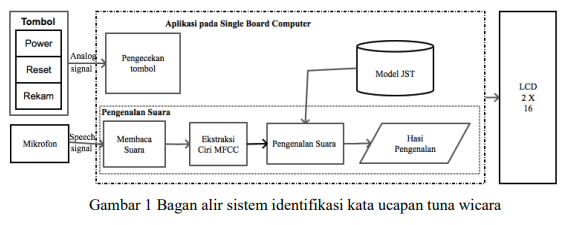

*2.2 Data Penelitian*
&nbsp;&nbsp;&nbsp;&nbsp;Metode JST backpropagation membutuhkan data masukan, dalam hal ini menggunakan fitur suara yang telah diekstraksi menggunakan metode MFCC. Adapun data yang digunakan pada penelitian ini ditunjukkan pada Tabel 1 dan 2.
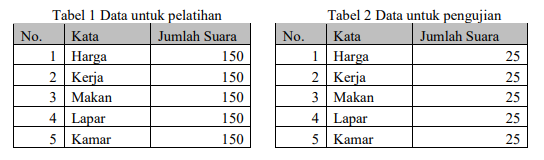

*2.3 Perancangan Sistem dan Alat Identifikasi Kata*
&nbsp;&nbsp;&nbsp;&nbsp;Sebagaimana ditunjukkan pada Gambar 1, yang berfungsi sebagai masukan adalah sensor suara atau mikrofon, Single Board Computer (SBC) sebagai pemproses dan LCD sebagai luaran.
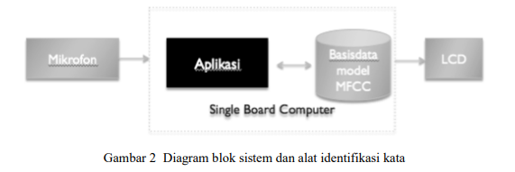

*2.3.1 Mikrofon*
&nbsp;&nbsp;&nbsp;&nbsp;Mikrofon akan menangkap suara tunawicara sebagai masukan untuk sistem, lalu suara tersebut akan diproses oleh sistem yang sudah tertanam pada SBC.

*2.3.2 Single Board Computer (SBC)*
&nbsp;&nbsp;&nbsp;&nbsp;SBC digunakan untuk memproses sinyal suara, termasuk proses pengenalan pola, sehingga akan diketahui arti dari sinyal suara tersebut, hasil tersebut akan ditampilkan pada LCD. Aplikasi yang tertanam pada SBC bertugas untuk membaca masukan dari mikrofon melakukan pra-pemrosesan, ekstraksi fitur, pengenalan pola (perbandingan fitur masukan ke basisdata model MFCC) dan menampilkan arti suara melalui LCD. Diagram blok aplikasi yang dijalankan SBC ditunjukkan pada Gambar 3.
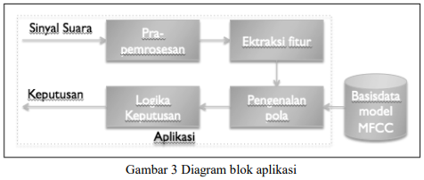

Alur proses yang dijalankan pada SBC meliputi:
a. Pra-pemrosesan
Sinyal yang ditangkap oleh mikrofon akan ditapis menggunakan penapis lowpass untuk menghilangkan atau mereduksi derau atau noise, meningkatkan energi sinyal dan melakukan normalisasi dari sinyal mentah ke dalam sinyal berskala sama.
b. Ektraksi fitur
Setelah dilakukan pra-pemrosesan sinyal, proses selanjutnya adalah pencarian fitur menggunakan algoritma MFCC.
c. Pengenalan pola
Melakukan perbandingan pola dari pola masukan mikrofon dengan pola-pola yang tersimpan pada basisdata model MFCC.
d. Logika keputusan
Setelah pola dikenali, maka akan diperoleh arti kata dari suara yang ditangkap oleh mikrofon, arti kata akan ditampilkan di LCD.

*2.3.3 Basisdata model MFCC*
Basisdata ini menyimpan model fitur dari suara yang telah melewati berbagai proses, yaitu:
1. Ekstraksi fitur
   Ekstraksi fitur speech akan menggunakan MFCC yang nantinya akan menghasilkan vektor fitur MFCC. Fitur MFCC dihitung menggunakan parameter-parameter berikut:
    - Pre-emphasis coefficients = -0,95
    - Frame size = 256 samples (16ms)
    - Frame overlap = 85 samples (5,3ms)
    - Number of Triangular bandpass filters = 20
    - Number of MFCCs = 6 dan 12
2. Klasifikasi fitur
   Klasifikasi fitur akan menggunakan JST backpropagation (sebagaimana ditunjukkan pada Gambar 4) dengan multi-layer perceptron yang memiliki fase maju (forward) dan fase balik (back) dan fitur yang akan digunakan adalah MFCC. Adapun hasil pelatihan menggunakan JST yang terbaik dalam kasus ini adalah yang memiliki nilai epoch dan error terkecil. Fitur MFCC berupa vektor (bernilai bilangan asli) dari fitur sinyal yang dihasilkan dari proses frame blocking & windowing, FFT, Mel Frequency wrapping, Log dan Discrete Cosine Transform (DCT). Konfigurasi yang digunakan JST sebagai berikut :
   - Input layers = 6 dan 12 nodes
   - Hidden layers = 4 nodes
   - Output layers = 3 nodes
   - Hidden layer transfer function = Hyperbolic tangent
   - Output layer transfer function = Linear
   - Epoh = 0, MSE =1.
   - Maksimum Epoh = 100.000,
   - Target Error = 1e-010
   - Learning Rate = 0,2
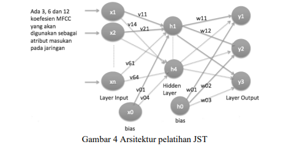
    Jumlah node masukan sama dengan jumlah koefisien yang diperoleh dari MFCC, jadi menggunakan 6 dan 12 node masukan.
3. Pelatihan dan Pengujian Fitur
   Kegiatan pelatihan tergolong berat karena banyaknya proses yang dilakukan, oleh karena itu dilakukan menggunakan komputer dan perangkat lunak Matlab. Diagram blok pelatihan dapat ditunjukkan pada Gambar 5.
   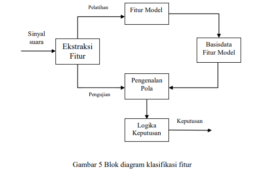

*2.3.3 LCD*
&nbsp;&nbsp;&nbsp;&nbsp;LCD sebagai sarana luaran, menampilkan arti dari kata yang sudah ditentukan oleh
sistem.

*2.3 Perancangan Sistem*
&nbsp;&nbsp;&nbsp;&nbsp;Mikrofon digunakan sebagai masukan untuk sistem, sebagaimana ditunjukkan pada Gambar 6. Mikrofon, sebagai sensor suara, menghasilkan sinyal analog yang kemudian dilewatkan ADC (Analog to Digital Converter) agar diperoleh sinyal digital terkait. Sinyal digital tersebut menjadi masukan untuk SBC yang sudah dilengkapi dengan modul JST.
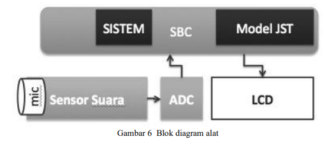
&nbsp;&nbsp;&nbsp;&nbsp;Setelah alat dirakit (sebagaimana ditunjukkan pada Gambar 10) dan ditanamkan program terkait kedalamnya, selanjutnya dilakukan pengujian. Gambar 7 menunjukkan saat alat dihidupkan untuk pertama kali, yaitu melakukan proses inisialisasi, kemudian beberapa saat alat akan siap untuk menerima data suara yang akan dikenali (ditunjukkan pada Gambar 8). Kata yang diucapkan, akan ditangkap oleh sensor, lalu akan di proses oleh sistem yang sudah ditanam di SBC, lalu akan menampilkan hasil, sebagaimana ditunjukkan pada Gambar 9.
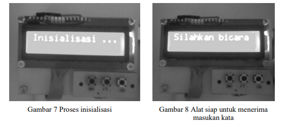
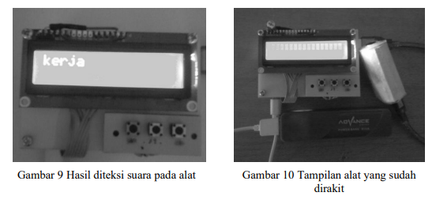

3. HASIL DAN PEMBAHASAN

*3.1 Hasil Penelitian*
&nbsp;&nbsp;&nbsp;&nbsp;Hasil pelatihan dan pengujian JST Backpropagation menggunakan beberapa kombinasi learning rate, maksimal epoch dan nilai toleransi error ditunjukan pada Tabel 3.
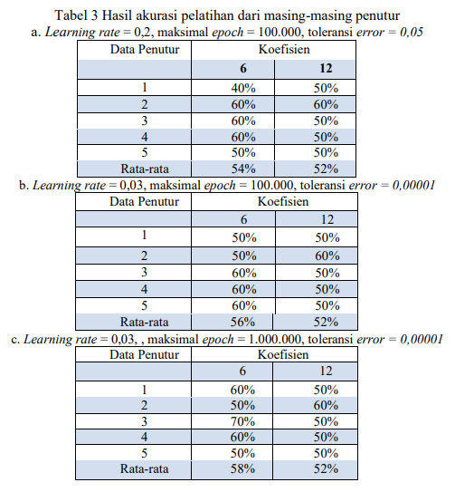
*3.2 Pelatihan dan Pengujian Sistem*
&nbsp;&nbsp;&nbsp;&nbsp;Tabel 3a, Tabel 3b, dan Tabel 3c menunjukan bahwa masukan JST Backpropagation menggunakan 6 koefisien memiliki rerata akurasi lebih baik, yaitu 54%, 56% dan 58%. Berdasarkan rerata akurasi koefisien 6 dan 12 (yang diperoleh dari rata-rata akurasi semua penutur) dapat disimpulkan bahwa hasil pada Tabel 3c mendapat hasil yang paling tinggi, menggunakan masukan 6 koefisien MFCC dan dilatih menggunakan JST dengan parameter learning rate = 0.03, maksimal epoch = 1.000.000 dan toleransi error = 0.00001. 
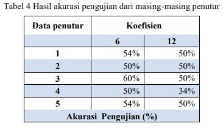
&nbsp;&nbsp;&nbsp;&nbsp;Proses pengujian mendapatkan hasil yang berbeda-beda, sebagaimana ditunjukan pada Tabel 4. Rata-rata akurasi tertinggi untuk semua penutur sebesar 54% ketika menggunakan MFCC dengan 6 koefisien. 

*3.3 Pengujian Alat Identifikasi Kata Ucapan Tunawicara*
&nbsp;&nbsp;&nbsp;&nbsp;Selain melakukan pengujian fungsional, dilakukan juga pengujian secara realtime menggunakan alat. Hasil akurasi, presisi dan sensitivitas dari masing-masing penutur ditunjukan pada Tabel 5. Pengujian menggunakan gabungan dari semua data penutur mendapatkan akurasi sebesar 40% menggunakan 6 koefisien MFCC. Tabel 5 juga menunjukan akurasi tertinggi ketika menggunakan data penutur ke 3 yaitu 60%, pengujian menggunakan data penutur 1, 2, 4 dan 5 mendapatkan hasil yang sama yaitu 50%. Sedangkan untuk presisi dan sensitivity dari pengujian per penutur, memiliki persentase yang sama, yaitu 40% untuk penutur 1, 2, 3 dan 5serta 50% untuk penutur 3.
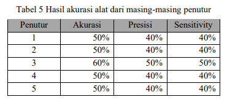

4. KESIMPULAN

&nbsp;&nbsp;&nbsp;&nbsp;Telah dibuat sebuah sistem (alat) yang mampu mengidentifikasi kata ucapan seorang tunawicara menggunakan metode MFCC dan JST Backpropagation. Akurasi alat mencapai 50% pada pengujian menggunakan data penutur 1, 2,4 dan 5 serta 60% ketika menggunakan data penutur 3. Presisi dan sensitivitas alat identifikasi mendapatkan persentase yang sama, yaitu 40% untuk penutur 1, 2, 4 dan 5 serta 50% untuk penutur 3. Alat memiliki sensitivitas 40%, presisi 40%, akurasi 50% untuk pengujian menggunakan semua data penutur.

4. SARAN

&nbsp;&nbsp;&nbsp;&nbsp;Perlu dilakukan penambahan fitur yang digunakan sebagai masukan JST dan memilih sensor suara yang lebih baik lagi, yang mampu bertahan terhadap noise.
